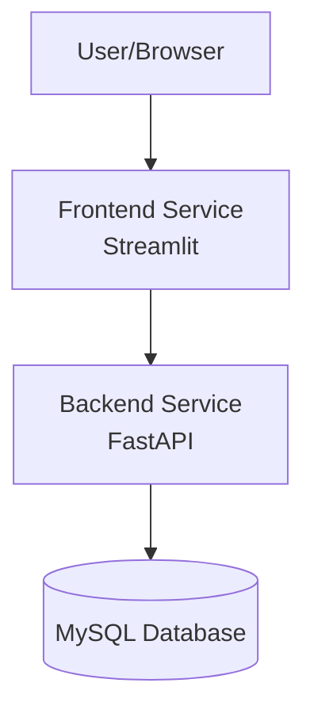
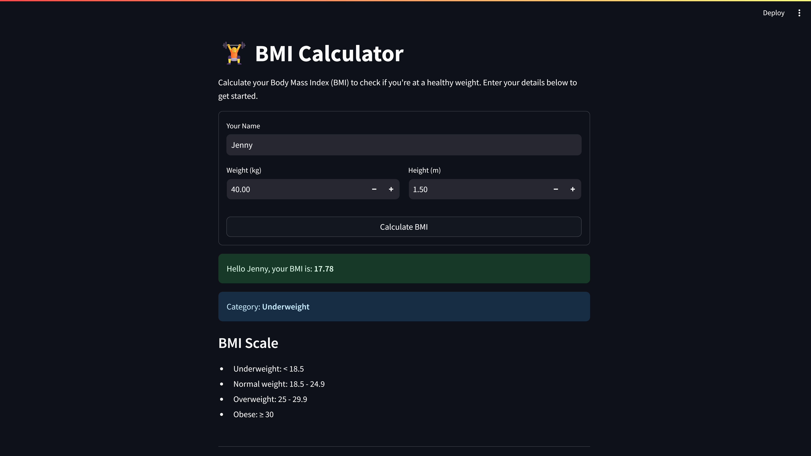
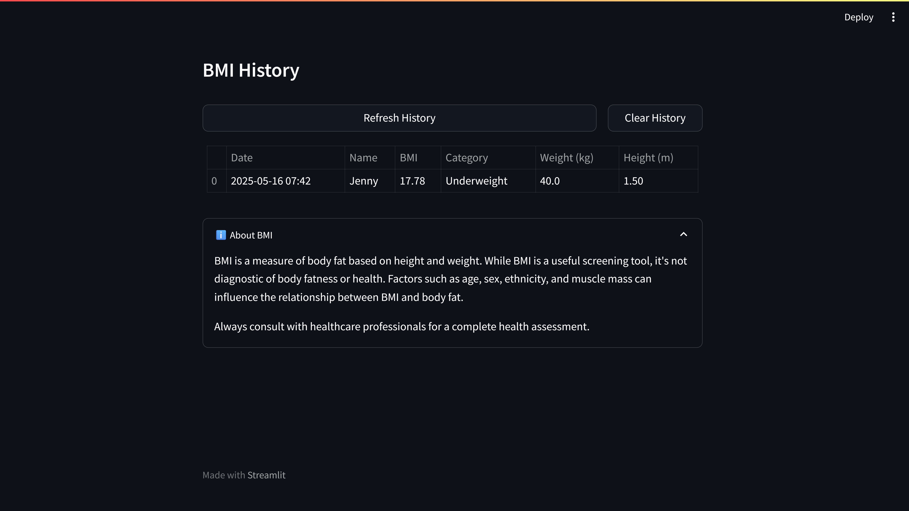

# BMI Calculator Microservice 🏋️‍♂️

A modern, BMI (Body Mass Index) calculator microservice built with FastAPI and Streamlit. This application follows the 12-Factor methodology for building software-as-a-service applications.

## ✨ Features

- **Real-time BMI Calculation**: Instantly calculate BMI with weight and height inputs
- **BMI History Tracking**: Store and view past BMI calculations
- **Modern UI**: Clean and responsive interface built with Streamlit
- **RESTful API**: Well-documented API endpoints using FastAPI
- **Database Integration**: Persistent storage using MySQL
- **Comprehensive Documentation**: Including API docs and deployment guides

### 🏭 12-Factor Compliance

> This application implements key principles from the twelve-factor methodology for building modern, scalable applications.

<details>
<summary>💫 View Implemented Principles</summary>

#### 1️⃣ **Codebase**

- Single codebase tracked in version control
- Enhanced with pre-commit hooks for code quality

#### 2️⃣ **Dependencies**

- Explicitly declared in requirements.txt
- Isolated in virtual environment

#### 3️⃣ **Config**

- Environment variables stored in .env
- Virtual environment setup for isolation

#### 4️⃣ **Backing Services**

- MySQL database treated as attached resource
- Clean separation of database configuration

#### 5️⃣ **Processes**

- Stateless application processes
- Clean separation of concerns

#### 6️⃣ **Port Binding**

- Services exported via port binding
- Backend and frontend on separate ports

#### 7️⃣ **Concurrency**

- Implemented using asyncio
- Scalable process model

#### 8️⃣ **Disposability**

- Fast startup and graceful shutdown
- Implemented using lifecycle event context managers

#### 9️⃣ **Logs**

- Implemented using Loguru
- Treated as event streams

</details>

## 🏗️ Architecture



## 🛠️ Tech Stack

- **Backend**: FastAPI (Python)
- **Frontend**: Streamlit
- **Database**: MySQL
- **Documentation**: MkDocs with Material theme
- **Testing**: pytest
- **Logging**: Loguru

## 📦 Prerequisites

- Python 3.8 or higher
- MySQL 8.0 or higher
- pip (Python package manager)
- Git (optional)

## 🚀 Quick Start

1. **Clone the repository**

   ```bash
   git clone https://github.com/yourusername/bmi-calculator-microservice.git
   cd bmi-calculator-microservice
   ```

2. **Set up Python virtual environment**

   ```bash
   # Windows
   python -m venv venv
   .\venv\Scripts\activate

   # Linux/MacOS
   python3 -m venv venv
   source venv/bin/activate
   ```

3. **Install dependencies**

   ```bash
   pip install -r requirements.txt
   ```

4. **Configure database**

   - Install MySQL if not already installed
   - Create a new database:
     ```sql
     CREATE DATABASE bmi_database;
     ```
   - Create `.env` file in the backend directory:
     ```env
     DATABASE_HOST=localhost
     DATABASE_USER=your_username
     DATABASE_PASSWORD=your_password
     DATABASE_NAME=bmi_database
     DATABASE_PORT=3306
     ```

5. **Start the backend service**

   ```bash
   cd _12factor_bmi_microservice\backend; uvicorn main:app --reload
   ```

   Backend will be available at: http://localhost:8000

6. **Start the frontend service** (in a new terminal)
   ```bash
   cd _12factor_bmi_microservice/frontend; streamlit run app.py
   ```
   Frontend will be available at: http://localhost:8501

## 📁 Project Structure

```
_12factor_bmi_microservice/              # Root directory
├── _12factor_bmi_microservice/          # Inner directory
│   ├── backend/                         # Backend service
│   │   └── main.py                      # FastAPI application
│   └── frontend/                        # Frontend service
│       └── app.py                       # Streamlit interface
├── tests/                               # Test files
│   └── test_bmi_api.py                  # API tests
├── docs/                                # Documentation
├── images/                              # Screenshots
├── .env                                 # Environment variables
└── requirements.txt                     # Dependencies
```

## 🔌 API Endpoints

### Calculate BMI

```http
POST /calculate-bmi
```

Request body:

```json
{
  "name": "string",
  "weight": "float", // in kilograms
  "height": "float" // in meters
}
```

### Get BMI History

```http
GET /bmi/history
```

### Clear History

```http
DELETE /bmi/history
```

## 📊 BMI Categories

| Category      | BMI Range   |
| ------------- | ----------- |
| Underweight   | < 18.5      |
| Normal weight | 18.5 - 24.9 |
| Overweight    | 25 - 29.9   |
| Obese         | ≥ 30        |

## 🧪 Running Tests

```bash
pytest tests/test_bmi_api.py -v
```

## 📚 Documentation

- API Documentation: http://localhost:8000/docs
- Project Documentation: http://localhost:8000 (after running `mkdocs serve` in the docs directory)

## 🔒 Security

- Input validation on both frontend and backend
- Database connection pooling
- Environment variable configuration
- No sensitive data exposure

## 📸 Screenshots

### BMI Calculator Interface



### BMI History and Results


