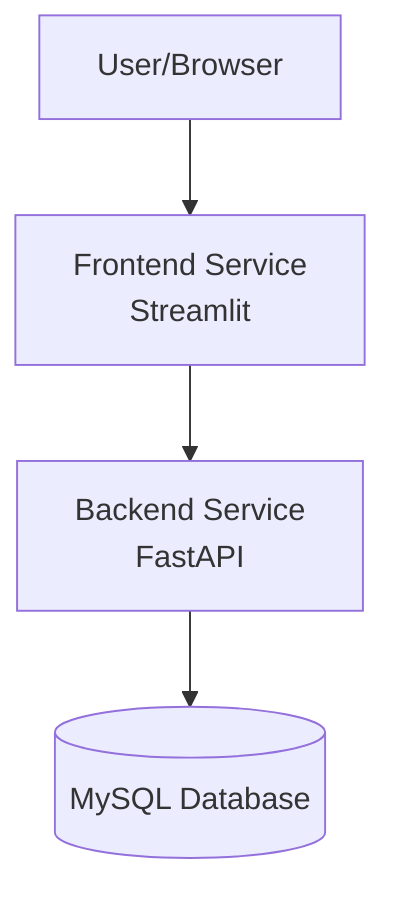

# Architecture Overview

The BMI Calculator Microservice follows a modern microservices architecture, adhering to the 12-factor app methodology for cloud-native applications.

## System Architecture

## Components

### Frontend Service

- Built with Streamlit
- Provides interactive web interface
- Handles user input validation
- Communicates with backend via REST API
- Displays BMI results and history

### Backend Service

- Built with FastAPI
- Implements RESTful API endpoints
- Handles BMI calculations
- Manages database operations
- Provides error handling and logging

### Database

- MySQL database
- Stores BMI calculation history
- Maintains user records
- Provides data persistence

## 12-Factor Compliance

1. **Codebase**: One codebase tracked in version control
2. **Dependencies**: Explicitly declared and isolated
3. **Config**: Stored in environment variables
4. **Backing Services**: Database treated as attached resource
5. **Build, Release, Run**: Strict separation of stages
6. **Processes**: Stateless application
7. **Port Binding**: Self-contained services
8. **Concurrency**: Horizontal scaling possible
9. **Disposability**: Fast startup and graceful shutdown
10. **Dev/Prod Parity**: Development matches production
11. **Logs**: Treated as event streams
12. **Admin Processes**: Run as one-off tasks

## Data Flow

1. User enters data in web interface
2. Frontend validates input
3. Request sent to backend API
4. Backend calculates BMI
5. Result stored in database
6. Response returned to frontend
7. Result displayed to user

## Security Considerations

- Input validation on both frontend and backend
- Database connection pooling
- Error handling and logging
- Environment variable configuration
- No sensitive data exposure

## Scalability

The architecture supports horizontal scaling:

- Stateless backend services
- Connection pooling for database
- Independent frontend instances
- Load balancer ready

## Monitoring

- API endpoint logging
- Database query logging
- Error tracking
- Performance metrics collection

## Future Enhancements

1. Authentication and authorization
2. Rate limiting
3. Caching layer
4. Metrics dashboard
5. Container support
6. CI/CD pipeline
