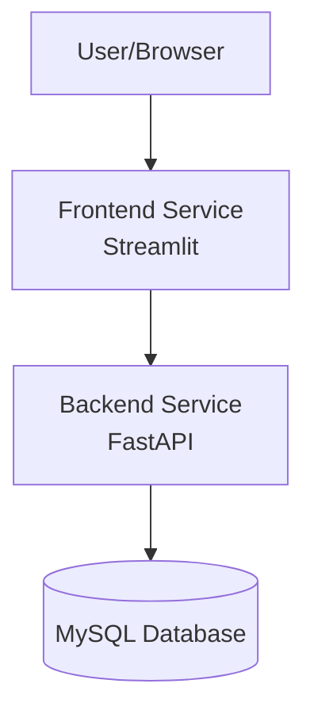

# BMI Calculator Microservice

Welcome to the BMI Calculator Microservice documentation. This project is a modern, scalable microservice that follows the 12-Factor methodology for building software-as-a-service applications.

## ✨ Features

- **Real-time BMI Calculation**: Instantly calculate BMI with weight and height inputs
- **BMI History Tracking**: Store and view past BMI calculations
- **Modern UI**: Clean and responsive interface built with Streamlit
- **RESTful API**: Well-documented API endpoints using FastAPI
- **Database Integration**: Persistent storage using MySQL
- **12-Factor Compliant**: Following cloud-native best practices
- **Comprehensive Documentation**: Including API docs and deployment guides

## 🏗️ Architecture



## 🛠️ Tech Stack

- **Backend**: FastAPI (Python)
- **Frontend**: Streamlit
- **Database**: MySQL
- **Documentation**: MkDocs with Material theme
- **Testing**: pytest
- **Logging**: Loguru

## 📚 Documentation Types

### API Documentation

The API documentation is automatically generated by FastAPI and is available when the backend service is running:

- **Swagger UI**: Available at `http://localhost:8000/docs`
- **ReDoc**: Available at `http://localhost:8000/redoc`

These provide interactive documentation for all API endpoints, including:

- Request/Response schemas
- Authentication methods
- Example requests
- Try-it-out functionality

### Project Documentation

You're currently viewing the project documentation, which covers:

- Getting Started Guide
- Architecture Overview
- Development Guide
- Deployment Instructions
- Testing Procedures
- Security Considerations

## 🔒 Security

- Input validation on both frontend and backend
- Database connection pooling
- Environment variable configuration
- No sensitive data exposure

## 🧪 Testing

The project includes comprehensive test coverage:

```python
def test_calculate_bmi_normal_weight(test_client):
    """Testing BMI calculation for normal weight"""
    test_input = {
        "name": "John Doe",
        "weight": 70.0,  # kg
        "height": 1.75   # meters
    }
    response = test_client.post("/calculate-bmi", json=test_input)
    assert response.status_code == 200
    data = response.json()
    assert data["category"] == "Normal weight"
```

## 🌟 Future Enhancements

- [ ] User authentication
- [ ] Data export functionality
- [ ] Metric/Imperial unit conversion
- [ ] BMI trends visualization
- [ ] Docker containerization
- [ ] CI/CD pipeline

## 📧 Contact & Support

For questions, issues, or contributions, please:

1. Check the [FAQ](getting-started/faq.md)
2. Review [existing issues](https://github.com/pravatn01/_12factor_bmi_microservice/issues)
3. Create a new issue if needed
4. Contact the maintainers
